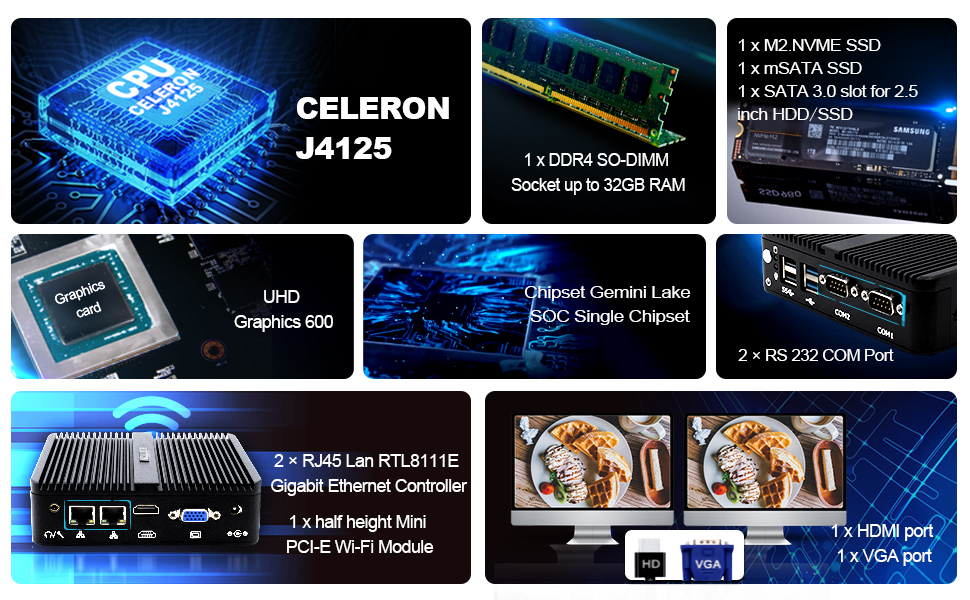
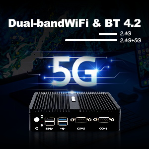

En el mundo actual, donde la velocidad, la eficiencia y la portabilidad son clave, la Mini PC que te presentamos es la solución perfecta para satisfacer tus necesidades informáticas diarias. Equipada con características impresionantes y un diseño innovador, esta mini computadora es una herramienta esencial tanto para el trabajo como para el entretenimiento en el hogar.

Memoria y Almacenamiento: Con una memoria de última generación, cuenta con un zócalo SO-DIMM DDR4L de 260 pines, lo que garantiza un rendimiento óptimo. Además, ofrece múltiples opciones de almacenamiento, incluyendo SATA3.0 para HDD/SSD de 2,5 pulgadas, SSD mSATA y SSD M.2 NVME (PCIE3.0 x 2), lo que te permite almacenar grandes cantidades de datos y acceder a ellos rápidamente.

Velocidad y Estabilidad: Impulsada por un potente procesador Intel Celeron J4125/J4105 Quad Core y con Windows 10 Pro preinstalado (64 bits), esta Mini PC ofrece una velocidad de ejecución impresionante y una estabilidad excepcional. Ya sea para tareas cotidianas o para proyectos exigentes, esta computadora está lista para enfrentar cualquier desafío.

Durabilidad y Diseño: Su carcasa de aleación de aluminio cepillado no solo le otorga un aspecto elegante, sino que también proporciona una excelente resistencia al agua y al polvo, aumentando así su vida útil. Además, su diseño sin ventilador garantiza un funcionamiento silencioso y evita la entrada de polvo en su interior, lo que contribuye a una experiencia de uso sin interrupciones.

Conectividad y Entretenimiento: Con puertos HDMI y VGA, esta Mini PC permite la conexión simultánea de dos monitores, lo que facilita la multitarea y aumenta la productividad. Además, con el Intel UHD Graphics 600 integrado, disfrutarás de una calidad de imagen excepcional, perfecta para la navegación web en 4K, la reproducción de video y el entretenimiento en casa. Además, su soporte para WiFi de banda dual 2,4G/5,0G garantiza una conexión estable y rápida.

    

Conclusión: En resumen, esta Mini PC combina potencia, versatilidad y portabilidad en un paquete compacto. Ya sea que la utilices para trabajar desde casa, disfrutar del entretenimiento multimedia o como centro de control en tu negocio, esta computadora ofrece un rendimiento excepcional en cualquier situación. Es la compañera perfecta para aquellos que buscan un equipo confiable y eficiente que se adapte a su estilo de vida moderno.

    <a href="https://amzn.to/4a7XXkD" target="_blank">
        Comprar en amazon
    </a>

